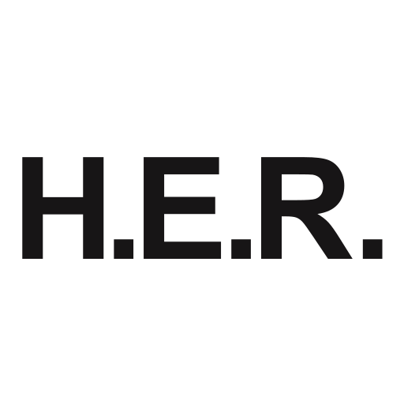
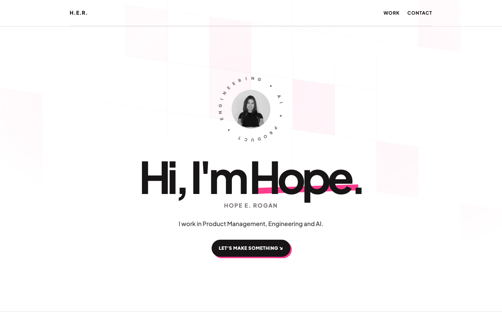

# Hope Rogan Portfolio Website

This repository contains the source code for my personal portfolio. Rather than using a template, the site was designed and built from scratch to reflect my approach to software engineering, with an emphasis on reusable components, smooth interactions, accessibility, and performance.

